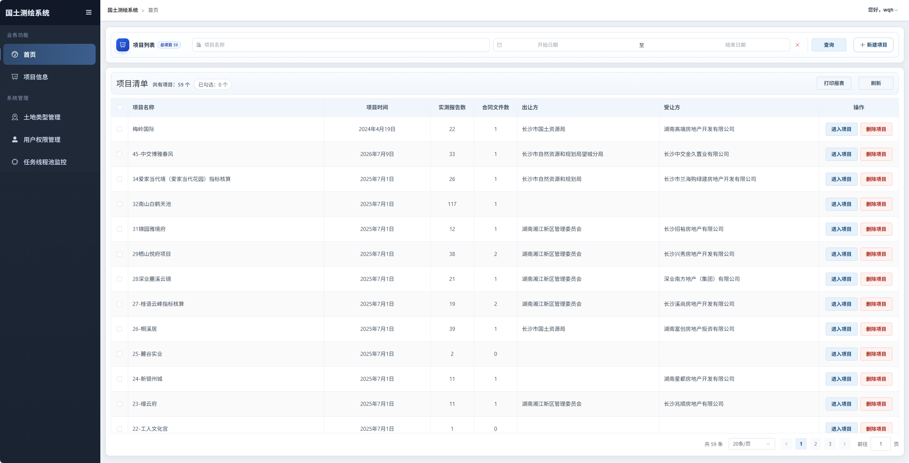
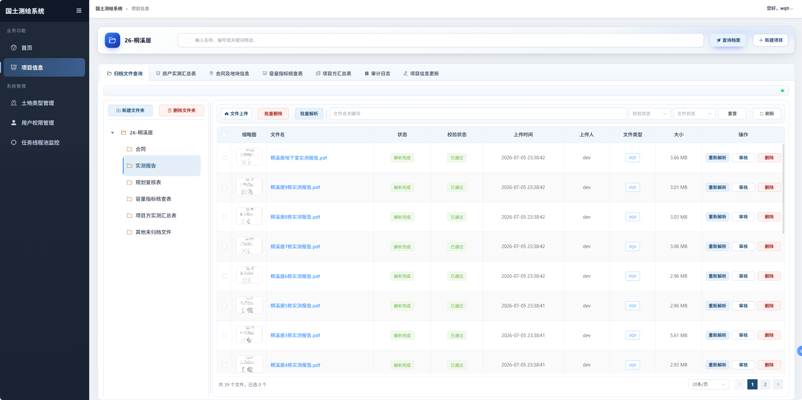
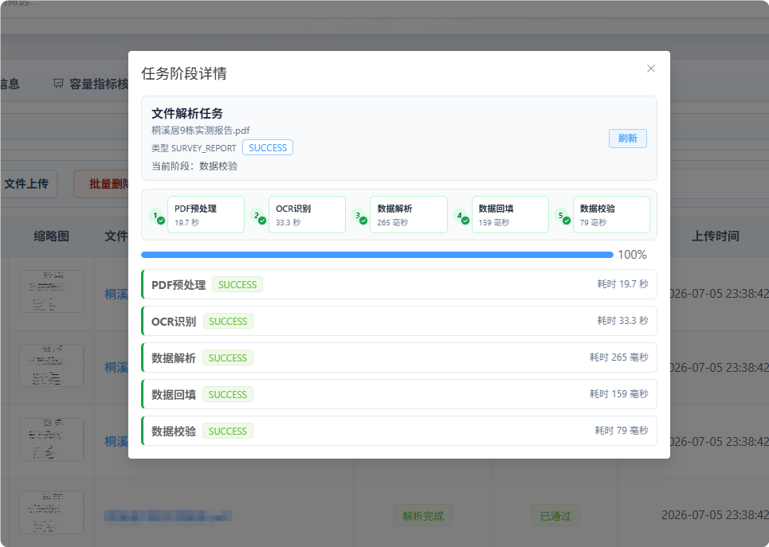
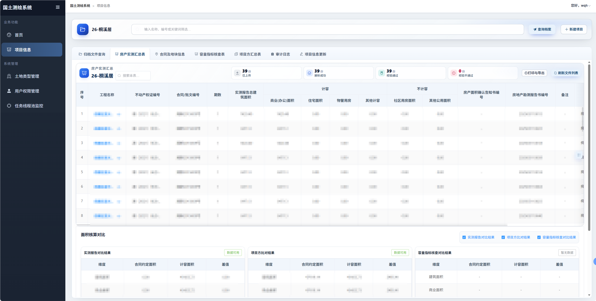

# LandCheck 前端

土地评估数据比对系统 Web 端。Vue 3 + Vite，对接后端 REST（Sa-Token）与部分 WebSocket 通知。

配套后端仓库：`[land-backend](https://github.com/HongxHH/land-backend)`。

## 界面预览

### 首页仪表盘



> 登录后首页，能看出项目概览/入口。

### 项目信息与归档



> 项目列表或详情内归档夹，含文件状态/解析进度。

### 文件解析流程



> 文件解析流程界面。

### 汇总比对



## 技术栈


| 项    | 说明                          |
| ---- | --------------------------- |
| Vue  | 3.5                         |
| 构建   | Vite 7                      |
| UI   | Element Plus                |
| 路由   | Vue Router 4                |
| HTTP | Axios（Header `satoken`）     |
| 实时   | STOMP / SockJS              |
| 表格预览 | ExcelJS、`@vue-office/excel` |
| Node | `^20.19.0` 或 `>=22.12.0`    |


## 本地快速启动

```bash
npm install
npm run dev
```

浏览器打开 `http://localhost:5173`。未登录会跳到 `/login`。

## 目录约定

```
src/
  views/          页面
  components/     业务组件（按项目列表、上传、归档等分子目录）
  composables/    组合式逻辑
  router/         路由与权限
  utils/          鉴权、文件状态、请求封装
  styles/         全局样式
  config/         功能开关
```

